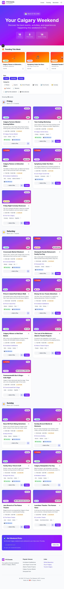

# 🚚 YYC Food Truck Tracker

> Find Calgary's best food trucks near you! 🌮🍔🌭🍦

[](https://choosealicense.com/licenses/mit/)
[](https://nextjs.org/)
[](https://www.typescriptlang.org/)
[](https://tailwindcss.com/)


## 📸 Screenshot



## 🌟 Features

- **🗺️ Interactive Map** - See all food trucks on a live map with real-time location updates
- **📍 Trucks Near Me** - Find food trucks closest to your current location
- **🔥 Popular This Week** - Discover the hottest trucks Calgary is talking about
- **🍽️ Cuisine Filters** - Filter by tacos, burgers, Asian, desserts, and more
- **🕐 Open Now Toggle** - Only show trucks currently serving
- **📱 Mobile-First** - Designed for on-the-go hungry Calgarians
- **📋 Full Menus** - View menu items with prices for each truck
- **📍 Report Locations** - Community-powered truck location reporting

## 🎨 Design

This app features a fun, vibrant design that captures the food truck spirit:

- **Warm Colors** - Oranges, yellows, and food-inspired palettes
- **Emoji-Heavy UI** - 🌮 🚚 🍔 🌭 🍦 throughout the interface
- **Smooth Animations** - Hover effects, transitions, and playful micro-interactions
- **Responsive** - Works beautifully on phones, tablets, and desktops

## 🚀 Quick Start

### Prerequisites

- Node.js 18+ 
- npm or pnpm

### Installation

```bash
# Clone the repo
git clone https://github.com/mizoz/yyc-food-truck-tracker.git
cd yyc-food-truck-tracker

# Install dependencies
npm install

# Run development server
npm run dev
```

Open [http://localhost:3000](http://localhost:3000) in your browser!

### Build for Production

```bash
npm run build
npm start
```

## 🍽️ Featured Calgary Food Trucks

This tracker includes 15+ real Calgary food trucks:

| Truck | Cuisine | Rating |
|-------|---------|--------|
| 🍜 The Naked Ninja | Asian Fusion | ⭐ 4.8 |
| 🍔 Burger 420 | Burgers | ⭐ 4.9 |
| 🌮 Nomad Street Food | Tacos | ⭐ 4.7 |
| 🥪 Butcher and The Baker | Sandwiches | ⭐ 4.6 |
| 🍦 Fiasco Gelato | Desserts | ⭐ 4.9 |
| 🌭 The Dog House | Hot Dogs | ⭐ 4.5 |
| 🥖 Sidewalk Citizen | Bakery | ⭐ 4.7 |
| 🥟 A Taste of Ukraine | Ukrainian | ⭐ 4.8 |
| 🍛 Naaco Truck | Indian | ⭐ 4.6 |
| 🥓 Bacon Bandits | Burgers | ⭐ 4.4 |
| 🥟 Perogy Boyz | Ukrainian | ⭐ 4.9 |
| 🌮 Los Compadres | Mexican | ⭐ 4.7 |
| 🍔 Alley Burger | Burgers | ⭐ 4.8 |
| 🍩 Jelly Modern Doughnuts | Desserts | ⭐ 4.6 |
| 🍢 Satay Brothers | Asian | ⭐ 4.5 |

## 🏙️ Calgary Food Truck Scene

Calgary has one of Canada's most vibrant food truck scenes! From the streets of Stephen Avenue to festivals at Prince's Island Park, food trucks have been serving hungry Calgarians since the early 2010s.

### Popular Spots to Find Trucks

- **Stephen Avenue Walk** - Downtown's pedestrian mall
- **Kensington Village** - Hip NW neighborhood
- **Marda Loop** - Trendy SW district  
- **East Village** - Near the Simmons Building
- **University District** - Near U of C campus
- **Beltline** - 17th Ave area

### Food Truck Season

Calgary's food truck season typically runs from **May to October**, with peak activity during:
- Calgary Stampede (July)
- Folk Music Festival (July)
- Various summer festivals and markets

Some trucks operate year-round, especially those with indoor locations or winter events!

## 🛠️ Tech Stack

- **Framework**: [Next.js 14](https://nextjs.org/) with App Router
- **Language**: [TypeScript](https://www.typescriptlang.org/)
- **Styling**: [Tailwind CSS](https://tailwindcss.com/)
- **Maps**: [React Leaflet](https://react-leaflet.js.org/) with OpenStreetMap
- **Icons**: [Lucide React](https://lucide.dev/)
- **Font**: Inter (Google Fonts)

## 📂 Project Structure

```
yyc-food-truck-tracker/
├── src/
│   ├── app/
│   │   ├── globals.css
│   │   ├── layout.tsx
│   │   ├── page.tsx
│   │   └── truck/[id]/page.tsx
│   ├── components/
│   │   ├── Header.tsx
│   │   ├── PopularSection.tsx
│   │   ├── TruckCard.tsx
│   │   └── TruckMap.tsx
│   └── data/
│       └── trucks.ts
├── public/
├── package.json
├── tailwind.config.ts
├── tsconfig.json
└── README.md
```

## 🤝 Contributing

Contributions are welcome! Feel free to:

1. Fork the repo
2. Create a feature branch (`git checkout -b feature/amazing-feature`)
3. Commit your changes (`git commit -m 'Add amazing feature'`)
4. Push to the branch (`git push origin feature/amazing-feature`)
5. Open a Pull Request

Ideas for contributions:
- Add more Calgary food trucks
- Integrate real-time location APIs
- Add user reviews
- Implement favorites persistence
- Add operating hours data

## 📝 License

This project is licensed under the MIT License - see the [LICENSE](LICENSE) file for details.

## 🙏 Acknowledgments

- Calgary's amazing food truck community 🍽️
- All the hardworking food truck owners and operators
- The City of Calgary for supporting street food culture

---

Made with ❤️ and 🍔 in Calgary, Alberta

**YYC Food Truck Tracker** - Never miss a delicious meal on wheels!